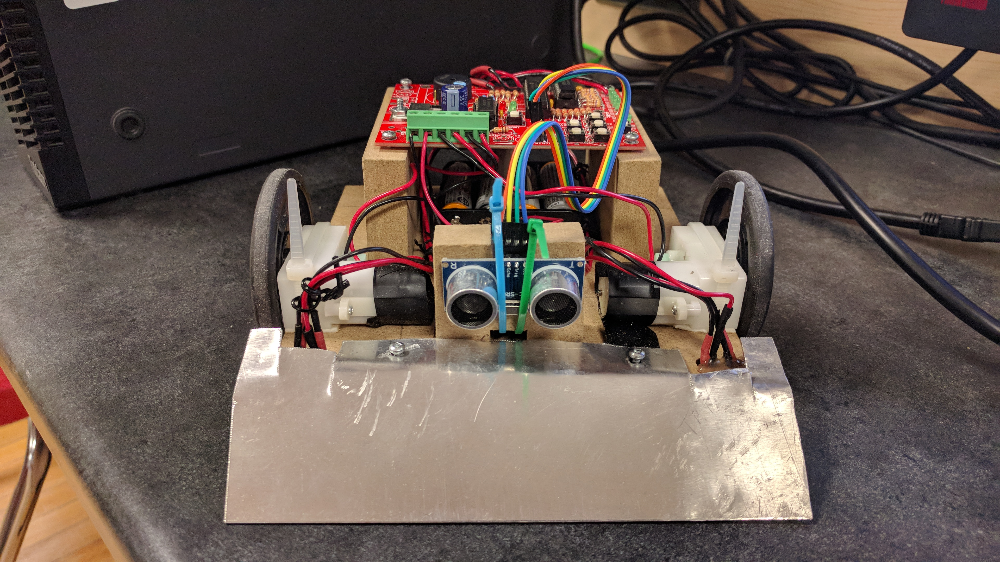
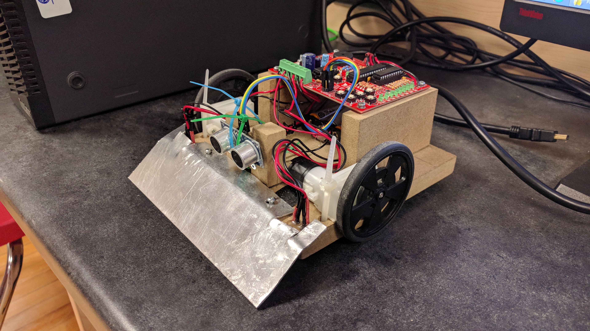
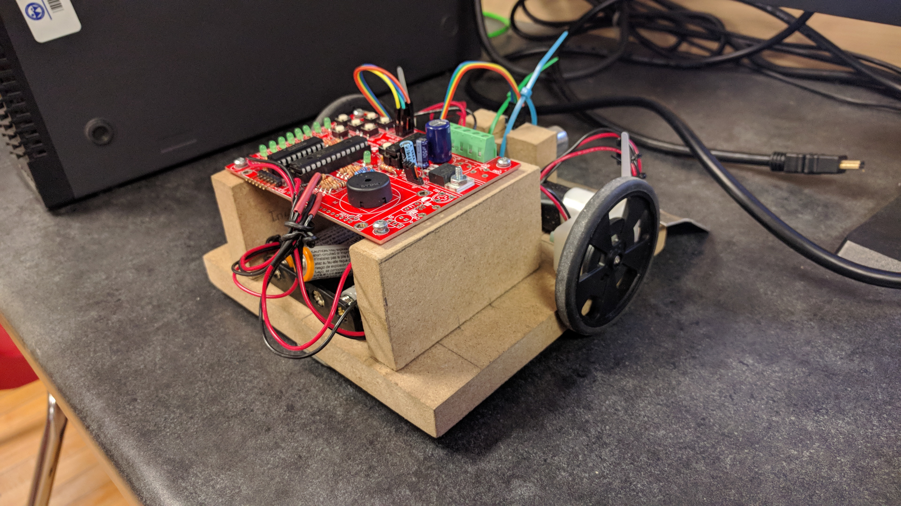

# SumoBot
The Sumo Bot that I made for Robotics Club in Grade 9. The bot detects an opponent through the ultrasonic sonar and tries to push them off the sumo ring.

Here is a short demo of a Sumo Bot Battle with my bot vs my tech teacher's bot (click on it to see the video).

## Pictures

Schematic Diagrams provided by my robotics teacher (https://www.siriusmicro.com/).
